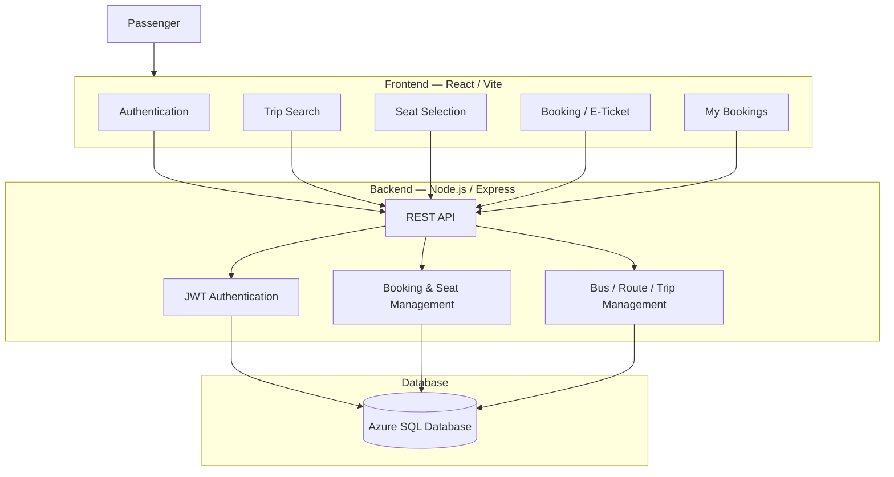

# Bus Ticket Booking System 🚌

ระบบจองตั๋วรถทัวร์ออนไลน์แบบครบวงจร พร้อมระบบจัดการสำหรับ Admin พัฒนาด้วย React, Node.js และ Azure SQL Database

```mermaid
flowchart TD

    U["Passenger"]

    subgraph FRONT["Frontend — React / Vite"]
        F1["Authentication"]
        F2["Trip Search"]
        F3["Seat Selection"]
        F4["Booking / E-Ticket"]
        F5["My Bookings"]
    end

    subgraph BACK["Backend — Node.js / Express"]
        B1["REST API"]
        B2["JWT Authentication"]
        B3["Booking & Seat Management"]
        B4["Bus / Route / Trip Management"]
    end

    subgraph DATA["Database"]
        D1[("Azure SQL Database")]
    end

    U --> FRONT

    F1 --> B1
    F2 --> B1
    F3 --> B1
    F4 --> B1
    F5 --> B1

    B1 --> B2
    B1 --> B3
    B1 --> B4

    B2 --> D1
    B3 --> D1
    B4 --> D1
```
